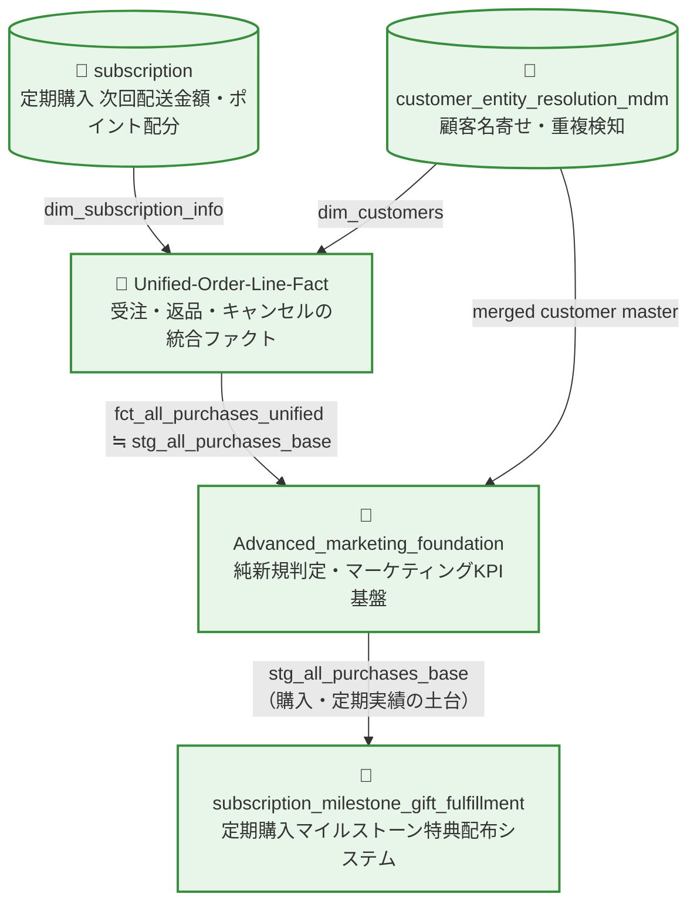

# SQL Design Patterns for Business Data Analysis

## 概要 / Overview

このリポジトリでは、ビジネスデータ分析およびデータ基盤構築で実際に使用される  
**SQL設計パターンとデータモデリングの考え方**をまとめています。

単なるSQLの書き方ではなく、以下のテーマを中心に整理しています。

- 複雑なビジネスロジックの整理
- データパイプライン設計
- データ品質管理（Data Quality / Observability）
- 再利用可能なSQL設計パターン

掲載しているSQLは、実務で使用していたロジックをベースに  
企業情報や機密情報を除去した**抽象化サンプル**として公開しています。

---

This repository contains **SQL design patterns and data modeling techniques**  
used in real-world business data analysis and data engineering.

The focus is not just writing SQL queries, but designing **reliable analytical datasets through structured query design**.

Topics covered include:

- SQL design for complex business logic
- Data pipeline structuring
- Window function based calculations
- Data modeling with explicit data grain
- Data quality monitoring and observability

All examples are abstracted from real-world SQL used in production environments,  
with company-specific information removed.

---

# SQL Design Philosophy

このリポジトリでは、SQLを以下の順序で設計することを重視しています。

1. **Business Purpose**  
   何のためのデータか（分析目的）

2. **Data Grain**  
   1行が何を表すか（例：`order_id × line_no`）

3. **Primary Key**  
   データの一意性の定義

4. **Table Relationships**  
   テーブル間の結合関係

5. **Calculation Logic**  
   Window関数や集計ロジック

6. **Data Quality Checks**  
   金額整合性や異常検知

単なるSQLクエリではなく  
**分析用データセットを設計するSQL**を重視しています。

---

When designing SQL, the following structured approach is used:

1. Business Purpose  
2. Data Grain  
3. Primary Key  
4. Table Relationships  
5. Calculation Logic  
6. Data Quality Checks  

The goal is not only writing SQL, but **designing reliable analytical datasets**.

---

# Example Topics Covered

このリポジトリでは、以下のような実務に近いSQL設計テーマを扱っています。

- 割引・ポイントの明細按分ロジック
- レガシーデータのヒューリスティック補正
- 返品注文と元注文のリンクキー生成
- Window関数による累積計算
- データ品質監視（Data Observability）
- 注文データの統合ファクトテーブル構築

These examples demonstrate SQL patterns used for:

- Financial amount allocation
- Heuristic classification for legacy datasets
- Parent–child order linking
- Running total calculations using window functions
- Data quality monitoring
- Building analytical fact tables

---

# Overall Architecture / 全体アーキテクチャ

`business_cases` 配下の5つのケースは、それぞれ独立したサンプルであると同時に、  
実際には**1つの大きなデータ基盤（受注データ統合 → マーケティングKPI基盤 → 顧客特典配布）を構成するモジュール群**として設計されています。

The five cases under `business_cases` can be read independently, but they are also designed as  
**modules of a single, larger data platform** (order data integration → marketing KPI foundation → customer reward fulfillment).



- **subscription**: 定期購入の金額・ポイント配分ロジック → `Unified-Order-Line-Fact` の定期情報として参照
- **customer_entity_resolution_mdm**: 顧客の名寄せ・重複検知 → `Unified-Order-Line-Fact` のブラックリスト判定、および `Advanced_marketing_foundation` の顧客統合に耐えうる純新規判定の土台
- **Unified-Order-Line-Fact**: 受注明細単位での金額・ステータスの統合ファクトテーブル構築（出力が次工程の入力になる）
- **Advanced_marketing_foundation**: 上記すべてを土台に、マーケティングKPI（純新規・LTV等）を算出するレイヤー
- **subscription_milestone_gift_fulfillment**: 定期購入が特定の累計本数に到達した顧客へデジタルギフトを付与する、20クエリ構成のCRM/マーケティング自動化パイプライン（最終レイヤー）

各ケースのREADMEには、この全体像における位置づけ（Upstream / Downstream）を明記しています。

---

# Repository Structure
```text
📁 sql-design-thinking
 ├── 📄 README.md
 └── 📁 business_cases
 │    └── 📁 subscription
 │    │
 │    └── 📁 customer_entity_resolution_mdm
 │    │
 │    └── 📁 unified_order_line_fact
 │    │
 │    └── 📁 advanced_marketing_foundation
 │    │
 │    └── 📁 subscription_milestone_gift_fulfillment
 │
 └── 📁 advanced_sql_recipes
```

Each directory represents a **business data modeling case**.

Typical structure:

query_name/
SQL implementation
README explaining business logic
Data modeling explanation
Data quality checks

---

# Target Audience

このリポジトリは主に以下のエンジニア向けに作成しています。

- BIエンジニア  
- データアナリスト  
- Analytics Engineer  
- データエンジニア  

特に、

**ビジネスデータを分析可能なデータセットへ変換するSQL設計**

に関心のある方を対象としています。

---

# Notes

本リポジトリのSQLは教育・共有目的で公開しています。

- 実際の企業データは含まれていません
- テーブル名やロジックは抽象化されています
- 特定の企業やサービスとは関係ありません

The SQL examples are published for educational purposes.  
No real company data is included.
