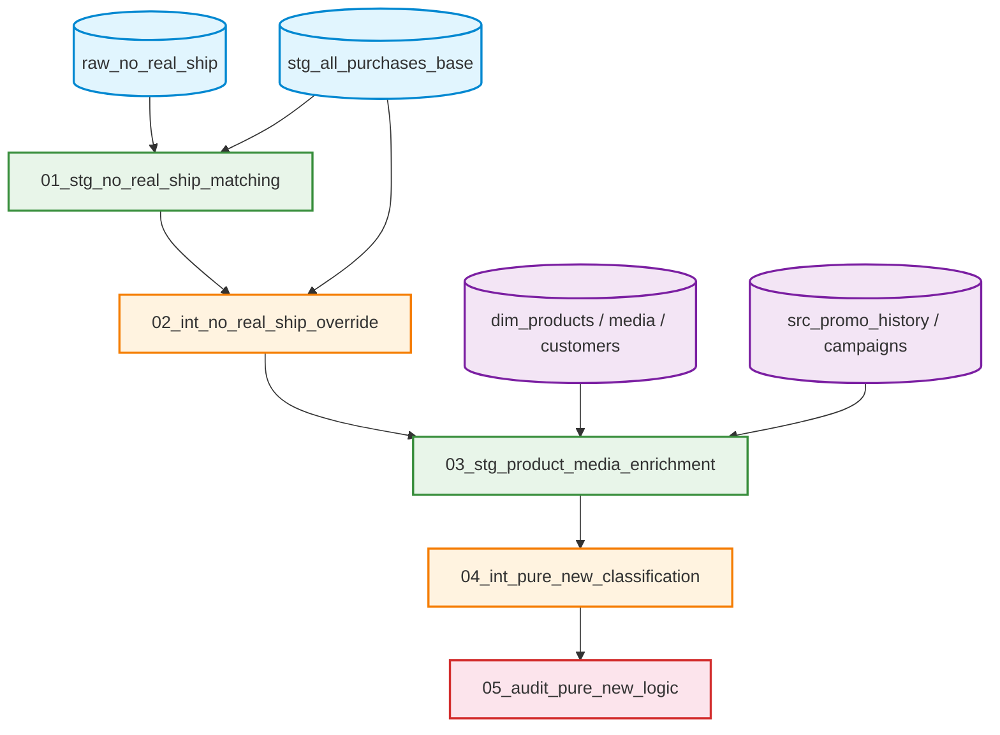

# Advanced Marketing Foundation (高度なマーケティング分析基盤)

## 概要 / Overview

本プロジェクトは、マーケティングKPI（LTV、CPA、CPO、継続率など）の土台となる「純新規フラグ」や「正確な売上実績」を算出するための、高度なデータ変換パイプラインです。

ECシステムの運用都合で発生する「ダミー出荷」による売上の二重計上や、システム統合（名寄せ）による「過去の新規ステータスの改変」といった、分析基盤を崩壊させるドロドロのビジネス課題を、SQLのみで数学的かつ堅牢に解決しています。

This project is an advanced data transformation pipeline that calculates foundational marketing KPIs such as "Pure-New" customer flags and accurate net sales. It mathematically and robustly resolves messy business problems—such as double-counted revenue caused by operational "dummy shipments" and retroactive alteration of historical statuses due to customer merges—using pure SQL.

---

## パイプライン・アーキテクチャ / Pipeline Architecture

本パイプラインは、実行順序（01〜05）とアーキテクチャレイヤー（Staging, Intermediate, Audit）によって完全にモジュール化されています。



---

## 主要な設計パターンと解決した課題 / Key Design Patterns  

このパイプラインでは、以下の高度なデータエンジニアリング手法（Design Patterns）を実装しています。  

1. カスケード型貪欲法による N対M JOIN爆発の解決  
(Cascade Greedy Algorithm for N-to-M Conflict Resolution)  

01_stg_no_real_ship_matching.sql  

システム上の紐付けキーが存在しない「ダミー出荷」と「形式的返品」を、商品構成のフィンガープリント（LISTAGG）と6段階のゲートマッチングで推測。複数のIDが競合する状態を、自己除外結合（Anti-Join）の連鎖を用いた貪欲法によって、SQLのみで完全に1対1（双方向ユニーク）に解消しています。  

2. ウィンドウ関数を活用した安全な欠損データの修復  
(Safe Data Restoration via Window Functions & Fail-safe Control)  

02_int_no_real_ship_override.sql  

旧システム仕様により「返品時に0円になってしまう欠損データ」に対し、対になるダミー出荷の正しい金額実績をウィンドウ関数で安全に伝播（Propagation）させて修復。紐付け失敗時はあえて残す「フェイルセーフ」も組み込み、売上消失リスクを排除しています。  

3. SCD Type 2 解決とフェイルセーフ型ディメンション統合  
(SCD Type 2 Resolution & Fail-safe Dimension Integration)  

03_stg_product_media_enrichment.sql  

広告LPの更新（改修）に合わせて、注文日時と更新日時を動的に比較。同じプロモコードでも購入タイミングによって新旧の媒体情報を正確に紐付ける SCD Type 2 を実現しています。また、マスタに存在しない幽霊顧客には強制的にフラグを立て、後続のCRM配信事故を防ぎます。  

4. 顧客統合に耐えうる 不変的（Immutable）な純新規判定  
(Immutable Pure-New Classification Logic Resilient to Customer Merges)  

04_int_pure_new_classification.sql  

顧客アカウントが名寄せ統合（Merge）された際、過去の履歴が混入して当時の「純新規」ステータスが失われるKPI改変バグを防止。統合顧客に対しては「獲得日」を起点に購入回数を動的に再採番（DENSE_RANK + PARTITION BY）し、過去に遡って変動しない不変のマーケティング指標を生成します。  

5. パイプライン品質監査と健康状態ラベリング  
(Pipeline Quality Audit & Health Status Labeling)  

05_audit_pure_new_logic.sql  

データマートを作成するだけでなく、その「ロジックの正当性」を監視する専用のAuditレイヤーを配置。「統合フラグは無いが、履歴と獲得日で判定が矛盾する層」を自動検知して構成比（%）を算出することで、テキストマイニングの抽出漏れ（False Negative）を早期発見するデータ・オブザーバビリティ（Data Observability）を実現しています。  

## ディレクトリ構成 / Directory Structure  

```Text
📁 advanced_marketing_foundation/
 ├── 📄 README.md (This file)
 │
 ├── 📁 01_staging/  (データクレンジング・紐付け・エンリッチメント)
 │    ├── 01_stg_no_real_ship_matching.sql
 │    └── 03_stg_product_media_enrichment.sql
 │
 ├── 📁 02_intermediate/  (複雑なビジネスロジックの適用・状態遷移の確定)
 │    ├── 02_int_no_real_ship_override.sql
 │    └── 04_int_pure_new_classification.sql
 │
 └── 📁 03_audit/  (データ品質の監視・テスト・異常検知)
      └── 05_audit_pure_new_logic.sql
```
