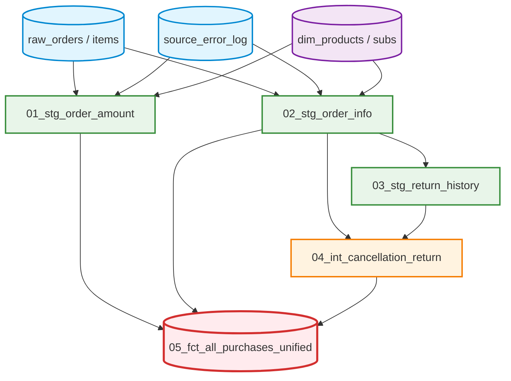

# Unified Order Line Fact (全購入情報 統合ファクトテーブル構築)

## 概要 / Overview

本プロジェクトは、定期購入（サブスクリプション）と単品購入、そして「キャンセル・返品」という極めて複雑なライフサイクルを持つEC受注データを、明細単位（Order Line Item Level）で完全に統合するデータパイプラインです。

割引の「1円のズレ」を許さない正確な金額案分、レガシーシステムにおけるカテゴリ欠損の推測、そして返品と売上のライフサイクルの分離といった、データウェアハウス構築における数々の難題を、モダンなデータモデリング手法（dbtライクな3層アーキテクチャ）で解決しています。

This project is a data pipeline that fully integrates e-commerce order data—encompassing subscriptions, one-time purchases, cancellations, and returns—at the order line-item level. It resolves several complex data warehousing challenges, such as penny-perfect discount proration, heuristic inference of missing categories in legacy systems, and the separation of lifecycles between gross sales and returns, utilizing a modern 3-tier architecture.

---

## リポジトリ全体における位置づけ / Position in the Overall Architecture

本ケースは単独でも成立しますが、リポジトリ全体では以下の**上流・下流ケース**と接続する前提で設計されています。

- **Upstream**: [subscription](../../subscription/)（定期購入情報 → `dim_subscription_info`）、[customer_entity_resolution_mdm](../../customer_entity_resolution_mdm/)（名寄せ済み顧客マスタ → `dim_customers`）
- **Downstream**: [Advanced_marketing_foundation](../../Advanced_marketing_foundation/)（本ケースの出力 `fct_all_purchases_unified` を `stg_all_purchases_base` として利用）

While this case is self-contained, it is designed to connect with the following **upstream / downstream cases** in the repository:

- **Upstream**: [subscription](../../subscription/) (subscription info → `dim_subscription_info`), [customer_entity_resolution_mdm](../../customer_entity_resolution_mdm/) (merged customer master → `dim_customers`)
- **Downstream**: [Advanced_marketing_foundation](../../Advanced_marketing_foundation/) (consumes this case's output `fct_all_purchases_unified` as `stg_all_purchases_base`)

リポジトリ全体のアーキテクチャは [トップレベルREADME](../../../README.md#overall-architecture--全体アーキテクチャ) を参照してください。

---

## パイプライン・アーキテクチャ / Pipeline Architecture

本パイプラインは、実行順序（01〜05）とアーキテクチャレイヤー（Staging, Intermediate, Marts）によってモジュール化されており、各クエリが単一の責任（Single Responsibility）を持っています。



---

## 主要な設計パターンと解決した課題 / Key Design Patterns

このパイプラインでは、以下の高度なデータエンジニアリング手法（Design Patterns）を実装しています。

### 1. 累積差分方式による Penny Perfect な金額案分
**(Penny-Perfect Proration via Cumulative Differences)**
> [01_stg_order_amount.sql](./01_staging/01_stg_order_amount.sql)
> 
> 注文全体にかかる割引（クーポン、ポイント）を複数明細に単純に割り算すると、端数処理により決済額と1〜2円のズレ（Rounding Error）が生じます。ウィンドウ関数の累積和（Running Sum）とLAG関数を用いて端数を高額商品に吸収させ、**財務システムと完全に一致する純売上データ**を構築しています。

### 2. ヒューリスティック推測と親子の絆キーの生成
**(Heuristic Classification & Order Link Key Generation)**
> [02_stg_order_info.sql](./01_staging/02_stg_order_info.sql)
> 
> 旧システムの仕様変更により欠損した定期カテゴリフラグを、商品構成等の状況証拠から推測（Heuristic Classification）して補完。さらに、返品データ（別IDとして発行される枝番）と出荷元データ（親注文）を紐付けるためのユニバーサルキー（`order_link_key`）を正規表現で生成しています。

### 3. 関心の分離による返品データの隔離
**(Separation of Concerns for Return Transactions)**
> [03_stg_return_history.sql](./01_staging/03_stg_return_history.sql)
> 
> 売上（プラス）と返品（マイナス）を同一パイプラインで処理すると、LTV計算や集計ロジックが極度に複雑化します。返品トランザクションのみを意図的に抽出・隔離（Isolate）し、生テーブルから専用の金額情報を付与することで、監査（Audit）や単独での返品分析に即応できるストックテーブルを構築しています。

### 4. 複合条件ステータスの競合解決と親への転写
**(Multi-Condition Evaluation & Parent-Child Status Transfer)**
> [04_int_cancellation_return.sql](./02_intermediate/04_int_cancellation_return.sql)
> 
> 「キャンセル」と「返品」のフラグが同時に立つといったステータス矛盾を防ぐため、ビジネスルール（返品＞キャンセル）に基づく優先順位解決ロジックを実装。確定したステータスを `order_link_key` を用いて「親注文」へ転写（Rollup）し、1注文につき1つの正しい状態を保証しています。

### 5. JOIN爆発の完全排除と安全な非正規化
**(Safe Denormalization & Prevention of JOIN Explosions)**
> [05_fct_all_purchases_unified.sql](./03_marts/05_fct_all_purchases_unified.sql)
> 
> 1つの注文に複数回の返品（-001, -002...）が発生した場合、単純なJOINでは売上が2倍3倍に増幅する大事故（JOIN爆発）が起きます。これを防ぐため、サブクエリ内で重複排除（Deduplication）を行い、`LISTAGG` 関数で返品理由を1行の文字列に集約してから結合する強固な防御設計を採用しています。

---

## ディレクトリ構成 / Directory Structure

```text
📁 unified_order_line_fact/
 ├── 📄 README.md (This file)
 │
 ├── 📁 01_staging/  (データクレンジング・金額案分・正規化)
 │    ├── 01_stg_order_amount.sql
 │    ├── 02_stg_order_info.sql
 │    └── 03_stg_return_history.sql
 │
 ├── 📁 02_intermediate/  (複雑なステータス判定と競合解決)
 │    └── 04_int_cancellation_return.sql
 │
 └── 📁 03_marts/  (BIツール向け最終統合ファクト)
      └── 05_fct_all_purchases_unified.sql
```
