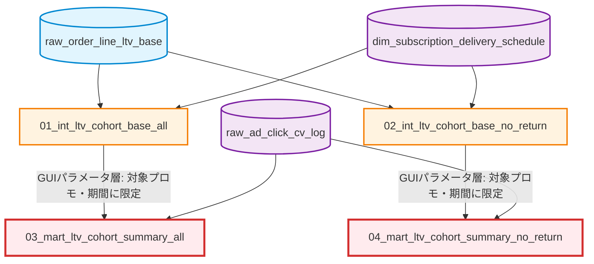

# LTV・残存率コホート分析 (LTV / Retention Cohort Analysis)

## 概要 / Overview

本ケースは、対象化粧品（定期購入美容液）の顧客ごとに初回購入(F1)から4回目購入(F4)までの購入・出荷実績を横持ちで集約し、LTV（顧客生涯価値）分析・残存率分析のためのコホートデータマートを構築する、4クエリ構成のパイプラインです。

最大の特徴は、返品・キャンセルの扱いについて「全対象版」「F2〜返品考慮版」という2つの並行モデルを最初から用意している点です。物流実態を監査したいのか、返品ノイズを除いた「本当のリピート顧客」の残存率を知りたいのかという、目的の異なる2つの分析ニーズに、同じF1起点定義を共有しつつ別々のクエリで応える設計になっています。両モデルの違いと、その根底にある返品・キャンセルの設計思想は[返品・キャンセルの取り扱いルール](./RETURN_CANCELLATION_RULES.md)にまとめています。

This case is a 4-query pipeline that consolidates a customer's 1st-through-4th purchase and shipment history into a wide cohort mart for LTV and retention analysis, for a subscription cosmetics product. Its defining feature is that it maintains two parallel models for return/cancellation handling from the ground up — an "all-targets" audit-grade model and a "return-excluded" pure-retention model — both sharing the same F1 cohort-anchor definition but serving different analytical needs. See [返品・キャンセルの取り扱いルール](./RETURN_CANCELLATION_RULES.md) for the full design philosophy behind this split.

---

## リポジトリ全体における位置づけ / Position in the Overall Architecture

本ケースは自己完結的な分析パイプラインです。他の`business_cases`（受注統合、マーケティング基盤、特典配布など）とはテーブルを共有せず、独立したサンプルとして読むことができます。

This case is self-contained. It does not share tables with the other `business_cases` (order integration, marketing foundation, gift fulfillment) and can be read as an independent example.

リポジトリ全体のアーキテクチャは [トップレベルREADME](../../README.md#overall-architecture--全体アーキテクチャ) を参照してください。

---

## パイプライン・アーキテクチャ / Pipeline Architecture

本パイプラインは2層（Intermediate, Marts）で構成され、2つの工程間にGUI（BIツール）のパラメータ層による絞り込みが挟まります。全対象版・返品考慮版は、それぞれ独立した2クエリの縦の系列として並走します。



---

## 主要な設計パターンと解決した課題 / Key Design Patterns

1. **返品・キャンセルの二層的取り扱いによる目的別モデルの並走** ([01](./01_int_ltv_cohort_base_all/), [02](./02_int_ltv_cohort_base_no_return/))
   F1確定ロジックを完全に共有しつつ、F2〜F4の返品を「保持して可視化する」か「除外して繰り上げ再採番する」かで分岐させ、物流監査とLTV分析という異なる目的に単一のF1起点定義で応える。

2. **同日複数注文の合算と代表属性伝播** ([01](./01_int_ltv_cohort_base_all/), [02](./02_int_ltv_cohort_base_no_return/))
   `DENSE_RANK`と`ROW_NUMBER`を用い、1注文内の複数商品・同日複数注文を1つの購入行動として合算しつつ、媒体・プロモ属性が混在しないよう最古注文の属性を伝播させる。

3. **返品除外後の再採番による歯抜けのないリピート順の再構築** ([02](./02_int_ltv_cohort_base_no_return/))
   `DENSE_RANK() + 1`で返品除外後の注文を前に詰めて再採番し、返品によって空いた回数を後続の正常注文が自動的に繰り上げて埋める。

4. **30日ルールによる評価タイミングの適正化**（両クエリ共通）
   前回出荷から一定日数（本モデルでは30日）経過していない顧客を評価対象から除外し、「まだ次回購入のタイミングに来ていない」顧客を離脱者として誤カウントしない。

5. **ディメンション整合GROUPING SETSによる多重粒度ロールアップとJOIN爆発防止** ([03](./03_mart_ltv_cohort_summary_all/), [04](./04_mart_ltv_cohort_summary_no_return/))
   受注側・アクセス側それぞれのGROUPING SETSに同一のディメンションを組み込み、統合JOINの結合条件も完全に同一の7項目キーで揃えることで、粒度ズレによるクロス結合の増殖バグを構造的に防止する。

6. **再帰CTEによるゼロ埋めカレンダーとベタ貼り対応のブロック順制御** ([03](./03_mart_ltv_cohort_summary_all/), [04](./04_mart_ltv_cohort_summary_no_return/))
   `WITH RECURSIVE`で月軸を動的生成し受注のない月もゼロ埋めで表示、`row_type_no`によりスプレッドシートへの貼り付けを想定したブロック順を絶対制御する。

---

## ディレクトリ構成 / Directory Structure

```text
📁 ltv_retention_cohort_analysis/
 ├── 📄 README.md (This file)
 ├── 📄 RETURN_CANCELLATION_RULES.md (返品・キャンセルの取り扱いルール)
 │
 ├── 📁 01_int_ltv_cohort_base_all/              (F1〜F4横持ちベースマート・全対象版)
 ├── 📁 02_int_ltv_cohort_base_no_return/        (F1〜F4横持ちベースマート・F2〜返品考慮版)
 │
 ├── 📁 03_mart_ltv_cohort_summary_all/          (月/取引先/コード別サマリー・全対象版)
 └── 📁 04_mart_ltv_cohort_summary_no_return/    (月/取引先/コード別サマリー・F2〜返品考慮版)
```

---

## 一般化について / Notes on Abstraction

本ケースは実運用のSQLをベースに、以下の観点で抽象化しています。

- 実在する広告代理店名（外部の取引先名）→「大手広告代理店由来のネット媒体」等の汎用表現に一般化
- 実在する商品名（定期購入美容液の商品ブランド）→「対象化粧品」に一般化
- 内部システム固有のテーブル・カラム識別子（`DP_SQL_JOB_xxxx`、`DP_CL_xxxxx`等）→ `raw_` / `stg_` / `int_` / `mart_` / `dim_` の命名規則に統一
- 実在するGUI/BIツール名 → 「GUIツール」「BIツール」に一般化
- 実際の運用日・分析用分類コード・販促商品区分コード等の具体的な値 → 条件の**構造**は保持しつつ、汎用的な仮の値・表現に置き換え
- GUI（BIツール）のパラメータ層で行われるフィルタ・加工工程（前工程の`【パラメータ01】`/`【パラメータ02】`）は、対応するSQLクエリのREADME・SQLコメント内で「GUIパラメータ層」として明記し、別クエリ化はしていません

---

## 設計判断の背景 / Design Decision Background

本ケースを一般化・ドキュメント化する過程で下した、クエリ個別のロジックとは別の構成上の判断を記録します（各クエリの設計パターン自体は、それぞれのREADMEの `SQL Design Pattern` セクションを参照してください）。

Beyond the logic of each individual query (documented in that query's own `SQL Design Pattern` section), this section records the structural decisions made while generalizing and documenting this case as a whole.

### 1. 外部組織名の一般化を、社内的な略称・記法よりも優先して扱う

**判断**: 元クエリのコメント内に実在する広告代理店名（外部の取引先）が記載されていた箇所は、他のいかなる一般化項目（内部システムのテーブル番号や商品名等）よりも優先して最初に除去・一般化した。

**理由**: 社内的な略称や内部システムの命名は「自社の情報がどこまで一般化されているか」の問題だが、外部の実在組織名は当該組織の実名を伴う関係性を外部に開示してしまうリスクがあり、情報の性質が異なる。実在する外部組織の名前を残したまま一般化作業を進めることは、たとえ一時的であっても避けるべきと判断した。

**トレードオフ**: 特になし。「大手広告代理店由来のネット媒体」という表現は元のロジック（特定の媒体経由の注文をF1起点として識別する）の構造を変えずに保持できている。

**Decision**: References to a real advertising agency (an external business partner) that appeared in the original queries' comments were removed and generalized first, ahead of every other generalization item (internal system table numbers, product names, etc.).
**Rationale**: Internal abbreviations and system-specific naming are a question of how much of *our own* information has been abstracted; a real external organization's name is different in kind, since it discloses a real-world business relationship. Leaving a real external party's name in place during generalization work — even temporarily — was judged unacceptable.
**Tradeoff**: None. The replacement phrase ("net media referred by a major advertising agency") preserves the original logic's structure (identifying orders from a specific referral channel as the F1 cohort anchor) without altering it.

### 2. GUI（BIツール）でのみ計算される中間テーブルは、SQLを新規に書き起こさず、プロース参照として扱う

**判断**: `stg_ltv_cohort_target_period_all` / `stg_ltv_cohort_target_period_no_return`など、元システムでGUI/BIツールのレシピステップとして処理されていた（SQLとして提供されなかった）中間テーブルについて、本リポジトリでは推測でSQLを書き起こすことをせず、各クエリのREADME・SQLコメント内に「GUIパラメータ層」として文章で説明するのみに留めた。

**理由**: 実際のGUI処理内容が不明な部分を、それらしいSQLとして書き起こすと、実在しないロジックを事実として提示してしまうリスクがある（本リポジトリの[subscription_milestone_gift_fulfillment](../subscription_milestone_gift_fulfillment/)ケースで採用した方針と同一）。

**トレードオフ**: 本ケースの4クエリだけではパイプラインが完全にend-to-endで実行可能な形にはならない（GUI層の入力を仮定する前提になる）。これは各クエリのREADME内で明記している。

**Decision**: For intermediate tables that the original system computed via GUI/BI-tool recipe steps rather than SQL (e.g. `stg_ltv_cohort_target_period_all` / `stg_ltv_cohort_target_period_no_return`), this repository does not fabricate a plausible-looking SQL file, documenting them only as prose ("GUI parameter layer") inside each query's README/SQL comments — the same policy adopted in this repository's [subscription_milestone_gift_fulfillment](../subscription_milestone_gift_fulfillment/) case.
**Rationale**: Writing plausible SQL for logic whose actual GUI-side implementation is unknown risks presenting fabricated logic as fact.
**Tradeoff**: This case's 4 queries alone do not form a fully executable end-to-end pipeline — they assume certain GUI-layer inputs as given, which is stated explicitly in each affected query's README.
