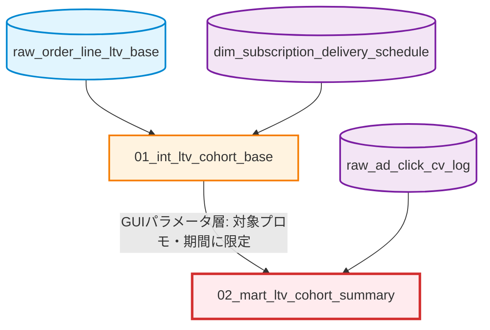

# LTV・残存率コホート分析 (LTV / Retention Cohort Analysis)

## 概要 / Overview

本ケースは、対象品（定期購入美容液）の顧客ごとに初回購入(F1)から4回目購入(F4)までの購入・出荷実績を横持ちで集約し、LTV（顧客生涯価値）分析・残存率分析のためのコホートデータマートを構築する、2クエリ構成のパイプラインです。

両クエリとも、返品も含めて「実際に何が起きたか」をそのまま記録する全対象版（実績監査モデル）として実装しています。返品ノイズを除いた「本当のリピート顧客」だけの残存率を見たい場合は、各クエリのREADME内「返品考慮版にする場合」で、どのCTEにどんな条件を加えればよいかをコード例つきで説明しています。

This case is a 2-query pipeline that consolidates a customer's 1st-through-4th purchase and shipment history into a wide cohort mart for LTV and retention analysis, for a subscription cosmetics product. Both queries are implemented as the "all-targets" audit-grade model (which records returns rather than excluding them); each query's README documents, with code examples, how to derive a return-excluded "pure retention" variant from it.

---

## リポジトリ全体における位置づけ / Position in the Overall Architecture

本ケースは自己完結的な分析パイプラインです。他の`business_cases`（受注統合、マーケティング基盤、特典配布など）とはテーブルを共有せず、独立したサンプルとして読むことができます。

This case is self-contained. It does not share tables with the other `business_cases` (order integration, marketing foundation, gift fulfillment) and can be read as an independent example.

リポジトリ全体のアーキテクチャは [トップレベルREADME](../../README.md#overall-architecture--全体アーキテクチャ) を参照してください。

---

## パイプライン・アーキテクチャ / Pipeline Architecture

本パイプラインは2層（Intermediate, Marts）で構成され、2つの工程間にGUI（BIツール）のパラメータ層による絞り込みが挟まります。



各クエリを返品考慮版に切り替える手順は、それぞれのREADMEの「返品考慮版にする場合」を参照してください。

---

## 返品・キャンセルの取り扱いと30日ルール / Return, Cancellation Handling & the 30-Day Rule

本ケースのLTV・残存率算出における中心的な設計思想です。改修前に必ず理解しておくべき内容をまとめます。

### 2つの返品フラグ

| フラグ名 | 意味 | 獲得件数に含めるか |
|---|---|---|
| `is_cnsl` | キャンセル。出荷前に取り消された注文 | 含めない（前工程で除外済み） |
| `is_return_no_refund` | 返金保証ではない返品。出荷後に受取拒否・不在返送等で戻った注文 | 含めない |
| `is_refund_eligibility` | 全額返金保証制度を使った返品 | **含める**（購買行動自体は成立しているため） |

F1（初回購入）は、`is_return_no_refund <> 1`の条件で厳密に除外した上で確定します（`purchase_1st` CTE）。これはLTV分析すべての起点になるため、ここで異常値を紛れ込ませると以降の集計全体が歪むためです。一方、返金保証を使った返品は購買行動自体が成立しているとみなし、除外しません。

### 30日ルール

「まだ次回分を買う時期に来ていない顧客」を離脱者としてカウントしてしまうと、残存率が実態より不当に低く見えてしまいます。そこで、前回出荷日から30日（対象品のおすすめ利用周期）が経過して初めて、その顧客を「評価対象」に含めます。

```sql
-- F2の評価対象になる条件: F1の出荷日から30日以上経過していること
CASE
    WHEN shipment_date_1st < 今日の日付 - 30日 THEN 1   -- 評価対象に含める
    ELSE 0                                              -- まだ評価対象外
END AS is_target_2nd
```

評価対象になった顧客の「継続」判定は、以下の2パターンのいずれかです。

1. 実際に出荷実績がある（すでにF2が出荷されている）
2. 未出荷だが、定期契約自体はアクティブ（`is_subsc_active = 1`、次回出荷が予定されている状態）

```sql
CASE
    WHEN is_target_2nd = 1 AND is_shipment_2nd = 1  THEN 1  -- 実際に出荷済み
    WHEN is_target_2nd = 1 AND is_shipment_2nd <> 1
     AND is_subsc_active = 1                        THEN 1  -- 未出荷だが定期継続中
    ELSE 0
END AS "2回目_継続フラグ"
```

これにより、「まだ次回出荷日が来ていないだけで、実際には解約していない顧客」を誤って「離脱」に分類してしまう事故を防いでいます。30日という日数を変更する場合は、対象品の利用周期に関わる業務判断のため、商品担当・マーケティング担当への確認が必要です。

### 全体像

```
【F1確定時】
  全注文
    ├─ キャンセル(is_cnsl=1)                       → 除外
    ├─ 返品・返金保証でない(is_return_no_refund=1) → 除外
    ├─ 返金保証を使った返品                         → 除外しない（獲得件数に含む）
    └─ 残った注文 = F1として確定（LTV分析の起点）

【F2以降の扱い（バージョンによって分岐）】
  F1確定後の注文
    ├─ 全対象版（本ケースの実装）→ 返品も含めてそのまま記録 ＋ 返品フラグで可視化
    └─ 返品考慮版（各クエリREADME参照）→ 返品を除外 → 残った注文を繰り上げ再採番

【評価タイミングの調整（30日ルール）】
  前回出荷日から30日経過していない → 「評価対象外」として、継続/離脱どちらにもカウントしない
  前回出荷日から30日経過している   → 出荷実績あり、または定期継続中なら「継続」、それ以外は「離脱」
```

---

## 主要な設計パターンと解決した課題 / Key Design Patterns

1. **返品・キャンセルの二層的取り扱い** ([01](./01_int_ltv_cohort_base/))
   F2〜F4の返品を「保持して可視化する」全対象版を基本実装としつつ、「除外して繰り上げ再採番する」返品考慮版への切り替え手順をREADMEに明記し、物流監査とLTV分析という異なる目的に単一のF1起点定義で応える。

2. **同日複数注文の合算と代表属性伝播** ([01](./01_int_ltv_cohort_base/))
   `DENSE_RANK`と`ROW_NUMBER`を用い、1注文内の複数商品・同日複数注文を1つの購入行動として合算しつつ、媒体・プロモ属性が混在しないよう最古注文の属性を伝播させる。

3. **30日ルールによる評価タイミングの適正化** ([01](./01_int_ltv_cohort_base/))
   前回出荷から一定日数（本モデルでは30日）経過していない顧客を評価対象から除外し、「まだ次回購入のタイミングに来ていない」顧客を離脱者として誤カウントしない。

4. **ディメンション整合GROUPING SETSによる多重粒度ロールアップとJOIN爆発防止** ([02](./02_mart_ltv_cohort_summary/))
   受注側・アクセス側それぞれのGROUPING SETSに同一のディメンションを組み込み、統合JOINの結合条件も完全に同一の7項目キーで揃えることで、粒度ズレによるクロス結合の増殖バグを構造的に防止する。

5. **再帰CTEによるゼロ埋めカレンダーとベタ貼り対応のブロック順制御** ([02](./02_mart_ltv_cohort_summary/))
   `WITH RECURSIVE`で月軸を動的生成し受注のない月もゼロ埋めで表示、`row_type_no`によりスプレッドシートへの貼り付けを想定したブロック順を絶対制御する。

---

## ディレクトリ構成 / Directory Structure

```text
📁 ltv_retention_cohort_analysis/
 ├── 📄 README.md (This file)
 │
 ├── 📁 01_int_ltv_cohort_base/          (F1〜F4横持ちベースマート・全対象版)
 └── 📁 02_mart_ltv_cohort_summary/      (月/取引先/コード別サマリー・全対象版)
```

---

## 一般化について / Notes on Abstraction

- 実在する広告代理店名（外部の取引先名）→「代理店由来のネット媒体」等の汎用表現に一般化
- 実在する商品名（定期購入美容液の商品ブランド）→「対象品」に一般化
- 内部システム固有のテーブル・カラム識別子（`DP_SQL_JOB_xxxx`、`DP_CL_xxxxx`等）→ `raw_`/`stg_`/`int_`/`mart_`/`dim_`の命名規則に統一
- 実在するGUI/BIツール名 → 「GUIツール」「BIツール」に一般化
- 実際の運用日・分析用分類コード等の具体的な値 → 条件の構造は保持しつつ汎用的な仮の値に置き換え
- 商品特有のコース名称（「初回2点コース」等）→ 業種を問わず通用する一般的な名称（「初回複数定期コース」等）に一般化
- GUIパラメータ層で行われるフィルタ・加工工程は、SQLとして書き起こさず、各クエリのREADME・SQLコメント内で「GUIパラメータ層」として明記
