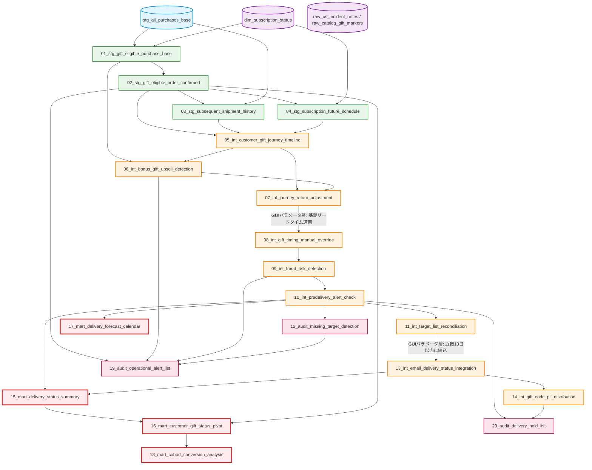

# Subscription Milestone Digital Gift Fulfillment System (定期購入マイルストーン特典配布システム)

## 概要 / Overview

本プロジェクトは、定期購入が特定の累計本数（マイルストーン）に到達した顧客に対し、デジタルギフト（ギフトコード）を特典として付与する、CRM/マーケティング自動化パイプラインです。

「初回から3本定期」「初回1本→2本/3本アップグレード」といった複数の申込コースを横断的に判定し、コールセンターのアウトバウンドによるアップセル、返品・解約による特典逃げ、配信タイミングの公平な調整、休日を跨いだ運用の安全性、個人情報保護まで、実務で発生するあらゆるイレギュラーをSQLで解決する20クエリから構成されています。

This project is a CRM/marketing automation pipeline that grants a digital gift (gift code) to customers who reach a subscription milestone (a cumulative bottle count). It spans multiple enrollment courses ("3 bottles from the start," "1 then upgraded to 2/3 bottles"), and resolves a wide range of real-world operational edge cases in pure SQL — outbound-call upsells, return/cancellation abuse, fair timing adjustments, holiday-safe list management, and PII protection — across 20 queries.

---

## 特典対象コースの詳細 / Course Details

本パイプラインが対象とする定期購入コースは2種類あり、それぞれ配信回数・タイミング・返品時の扱いが異なります。

### コース①: 初回から3本定期　例: 「初回3本_定期フラグ」など
初回から一貫して3本でお届けするコースです。お届け周期は約90日ごと。2回目・3回目の発送時点をマイルストーンとし、各発送後◯日でプレゼントを配信します（合計2回配信）。

### コース②: 初回1本→2本/3本アップグレード　例: 「初回1本→2本_定期フラグ」「初回1本→3本_定期フラグ」など
初回のみ1本でお届けし、約30日後の2回目からは2本または3本でお届けするコースです（お届け周期はそれぞれ約60日/約90日ごと）。3回目・4回目の発送時点をマイルストーンとし、各発送後◯日でプレゼントを配信します（合計2回配信）。

このうち「1本→2本」のコースのみ、2回目発送前にコールセンターから「3本定期への変更」を案内するアウトバウンドを実施する運用があります。案内に応じて実際にコースを変更した場合、2回目発送後に追加でもう1回プレゼントを配信します（[06_int_bonus_gift_upsell_detection](./06_int_bonus_gift_upsell_detection/) が該当）。

### 発送回数のカウントルール
- **発送前キャンセル**: 内容によらず回数カウントから除外します。
- **プレゼントに関わらないタイミングでの返品**: 初回発送分、および「1本→2本/3本」コースの2回目発送分（アップセルによる追加特典対象を除く）の返品は、回数カウントから除外します（[07_int_journey_return_adjustment](./07_int_journey_return_adjustment/) が該当）。
- **プレゼントに関わる発送分の返品**: プレゼント配信後の返品である可能性があるため、自動除外はせず、運用担当者による目視確認と手動判定に委ねます。

This pipeline covers two subscription enrollment courses, each differing in shipment count, timing, and how returns are handled.

### Course 1: 3 Bottles from the Start — e.g. flagged via `is_course_3bottle_first`, etc.
Ships 3 bottles consistently from the very first shipment, on an approximately 90-day cycle. The 2nd and 3rd shipments are the milestones; a gift is sent a set number of days after each of those two shipments (2 gifts total).

### Course 2: 1 Bottle → Upgraded to 2/3 Bottles — e.g. flagged via `is_course_upgraded_1_to_2` / `is_course_upgraded_1_to_3`, etc.
Ships 1 bottle for the first shipment only, then switches to 2 or 3 bottles starting with the 2nd shipment roughly 30 days later (on an approximately 60-day or 90-day cycle, respectively). The 3rd and 4th shipments are the milestones; a gift is sent a set number of days after each of those two shipments (2 gifts total).

Only the "1→2 bottle" course has an operational flow where the call center reaches out before the 2nd shipment to offer an upgrade to the 3-bottle course. If the customer actually switches courses in response, one additional gift is sent after the 2nd shipment (handled by [06_int_bonus_gift_upsell_detection](./06_int_bonus_gift_upsell_detection/)).

### Shipment-Count Rules
- **Cancellation before shipment**: Excluded from the count regardless of the reason.
- **Returns at a timing unrelated to the gift**: Returns of the 1st shipment, and of the 2nd shipment for the "1→2/3 bottle" course (excluding customers eligible for the bonus gift via upsell), are excluded from the count (handled by [07_int_journey_return_adjustment](./07_int_journey_return_adjustment/)).
- **Returns of a shipment tied to a gift**: Since this could be a return occurring *after* the gift was already sent, it is not auto-excluded — it's left to manual review and judgment by the operator.

---

## リポジトリ全体における位置づけ / Position in the Overall Architecture

本ケースは [Advanced_marketing_foundation](../Advanced_marketing_foundation/) の次工程として、`stg_all_purchases_base`（全購入基本データ）を土台に構築されています。

This case is the next step after [Advanced_marketing_foundation](../Advanced_marketing_foundation/), built on top of `stg_all_purchases_base`.

リポジトリ全体のアーキテクチャは [トップレベルREADME](../../README.md#overall-architecture--全体アーキテクチャ) を参照してください。

---

## パイプライン・アーキテクチャ / Pipeline Architecture

本パイプラインは4層（Staging, Intermediate, Marts, Audit）で構成され、20個のクエリが単一責任（Single Responsibility）を持って連携します。一部の工程間には、GUI（BIツール）のパラメータ層による軽量な絞り込み・加工が挟まります。



---

## 主要な設計パターンと解決した課題 / Key Design Patterns

1. **複数ファクトによる頑健な対象者判定と責務分離** ([01](./01_stg_gift_eligible_purchase_base/), [02](./02_stg_gift_eligible_order_confirmed/))
   単一のキャンペーンコードに依存せず、商品名表記・DM履歴・同梱物印字の3ファクトで対象者を確定。ユーザー単位／注文単位の手動例外処理を2段階に分割し、データ粒度混在によるバグを排除。

2. **属性伝播による統一タイムラインの構築** ([05](./05_int_customer_gift_journey_timeline/))
   F1のみが持つコース属性をウィンドウ関数で全履歴に伝播させ、実績と未来予定を`UNION ALL`で統合。どのレコードを見ても単独で特典条件を評価できる設計。

3. **島分割法（Island Method）による連続返品の安全な除外** ([07](./07_int_journey_return_adjustment/))
   `advanced_sql_recipes`のGaps and Islandsパターンと同系統の手法で、特典に無関係な連続返品を一括で除外し、注文番号の採番ズレを防止。

4. **経過割合ベースの公平な配信タイミング短縮アルゴリズム** ([08](./08_int_gift_timing_manual_override/))
   問い合わせ対応で「連絡した人だけ得をする」不公平を防ぐため、待機期間の経過割合に応じて残り日数を段階的に短縮する独自アルゴリズムを実装。

5. **自己結合によるペナルティの未来伝播** ([09](./09_int_fraud_risk_detection/))
   事後返品等の悪質行為を検知した際、そのペナルティを`order_no + 1`という未来のターゲットキーで自己結合し、次回の特典対象から確実に除外。

6. **休日対応ベルトコンベア制御と独立採番による脆弱性解消** ([11](./11_int_target_list_reconciliation/))
   曜日マスタで休日を判定し、手動リスト更新が止まる休日は現在分の変更を凍結。過去の最大採番Noを独立CTEに保管しCROSS JOINすることで、リストが空でも採番が1にリセットされる脆弱性を排除。

7. **JOIN条件によるタイムライン制限セキュリティ設計** ([14](./14_int_gift_code_pii_distribution/))
   金券同等の機密情報であるギフトコードを、`LEFT JOIN`の結合条件（フィルタではなく）で「過去・現在」の対象者にのみ紐付け、未来の対象者には構造的にコードが紐付かないことを保証。

8. **「最終到達」基準のエラー判定思想** ([15](./15_mart_delivery_status_summary/))
   配信の途中経過ではなく「最終的に顧客へ届いたか」という事実だけでエラーを判定し、再配信で救済されたケースを正しくエラーから除外。

9. **2つの時間軸を統合するコホート分析** ([18](./18_mart_cohort_conversion_analysis/))
   「受注月コホート」と「配信月カレンダー」という異なる時間軸を、YYYYMMを共通の座標軸として使う結合トリックで1つのマトリクスに統合。

10. **拡張可能なアラート集約と責務分離されたミュート機能** ([19](./19_audit_operational_alert_list/), [20](./20_audit_delivery_hold_list/))
    新しいチェックルールをCTE追加＋UNION ALLだけで拡張可能な設計。ミュート（既確認データの除外）処理を別クエリに分離し、アラート集計クエリの出力を純粋なKPIとして保持。

---

## ディレクトリ構成 / Directory Structure

```text
📁 subscription_milestone_gift_fulfillment/
 ├── 📄 README.md (This file)
 │
 ├── 📁 01_stg_gift_eligible_purchase_base/       (F1候補抽出・ユーザー単位例外対応)
 ├── 📁 02_stg_gift_eligible_order_confirmed/     (F1確定・注文単位例外対応・重複検知)
 ├── 📁 03_stg_subsequent_shipment_history/       (F2以降の継続出荷実績)
 ├── 📁 04_stg_subscription_future_schedule/      (定期購入の将来出荷予定展開)
 │
 ├── 📁 05_int_customer_gift_journey_timeline/    (顧客特典ジャーニー統合タイムライン)
 ├── 📁 06_int_bonus_gift_upsell_detection/       (アップセルによる追加特典対象判定)
 ├── 📁 07_int_journey_return_adjustment/         (返品による注文番号の補正)
 ├── 📁 08_int_gift_timing_manual_override/       (配信タイミングの手動調整)
 ├── 📁 09_int_fraud_risk_detection/               (不正リスクの4大防衛検知)
 ├── 📁 10_int_predelivery_alert_check/           (配信前10日プレチェック)
 ├── 📁 11_int_target_list_reconciliation/        (対象者リストの突合と自動採番)
 ├── 📁 13_int_email_delivery_status_integration/ (メール配信ステータスの統合判定)
 ├── 📁 14_int_gift_code_pii_distribution/        (ギフトコード・個人情報の安全な結合)
 │
 ├── 📁 15_mart_delivery_status_summary/          (配信ステータス統合表)
 ├── 📁 16_mart_customer_gift_status_pivot/       (顧客別特典ステータス横持ち表)
 ├── 📁 17_mart_delivery_forecast_calendar/       (配信予定件数カレンダー・在庫枯渇シミュレーション)
 ├── 📁 18_mart_cohort_conversion_analysis/       (コホート別到達率分析)
 │
 ├── 📁 12_audit_missing_target_detection/        (対象漏れ・復帰検知)
 ├── 📁 19_audit_operational_alert_list/          (運用アラート統合リスト)
 └── 📁 20_audit_delivery_hold_list/              (配信保留リスト)
```

---

## 一般化について / Notes on Abstraction

本ケースは実運用のSQLをベースに、以下の観点で抽象化しています。

- 実在するギフトサービス名（例：Amazonギフト券）→「デジタルギフト」に一般化
- 実在する商品ライン名 → `PRODUCT_LINE_A` / `PRODUCT_LINE_B` 等の汎用フラグ名に一般化
- 内部システム固有のテーブル・カラム識別子（`DP_SQL_JOB_xxxx`等）→ `raw_` / `stg_` / `int_` / `mart_` / `dim_` / `map_` の命名規則に統一
- GUI（BIツール）のパラメータ層で行われる軽量なフィルタ・加工工程は、対応するSQLクエリのREADME内で「GUIパラメータ層」として明記し、別クエリ化はしていません

---

## 設計判断の背景 / Design Decision Background

本ケースを一般化・ドキュメント化する過程で下した、クエリ個別のロジックとは別の構成上の判断を記録します（各クエリの設計パターン自体は、それぞれのREADMEの `SQL Design Pattern` セクションを参照してください）。

Beyond the logic of each individual query (documented in that query's own `SQL Design Pattern` section), this section records the structural decisions made while generalizing and documenting this case as a whole.

### 1. 元の場当たり的な番号（02_02、99_06等）を、01〜20の連番＋レイヤー接頭辞に統一する

**判断**: 元システムでは各クエリが `02_02`、`03_04`、`99_06` のような、追加された順序やGUIブロック番号に依存した場当たり的な番号を持っていた。本リポジトリでは、これを他の4ケースと同じ「01〜20の連番＋`stg_`/`int_`/`mart_`/`audit_` のレイヤー接頭辞」という命名規則に統一した。

**理由**: リポジトリ全体で一貫したディレクトリ構成・命名規則を保つことで、読者がケースを跨いで読む際の学習コストを下げる。また、レイヤー接頭辞により、各クエリがパイプライン内でどの役割（素材抽出／ビジネスロジック適用／最終成果物／監査）を担うかが名前だけで分かるようにした。

**トレードオフ**: 元の番号（例: `99_06`）が持っていた「どのGUIブロックの何番目の追加だったか」という開発履歴上の文脈は失われる。この対応関係が必要な場合は、各クエリのREADME内の記述で元の処理内容を追跡する必要がある。

**Decision**: The original system numbered each query ad hoc — based on the order it was added or its GUI block number (e.g. `02_02`, `03_04`, `99_06`). This repository renumbers all 20 queries into a clean `01`–`20` sequence with layer prefixes (`stg_`/`int_`/`mart_`/`audit_`), matching the other 4 cases.
**Rationale**: A consistent naming/directory convention across the whole repository lowers the learning cost of reading across cases, and the layer prefix makes each query's pipeline role (extraction, business logic, final deliverable, or audit) visible from its name alone.
**Tradeoff**: The original numbers' development history — which GUI block a step was added under, and in what order — is lost. Recovering that context now requires reading the description of the original processing inside each query's README.

### 2. GUI（BIツール）でのみ計算される中間テーブルは、SQLを新規に書き起こさず、プロース参照として扱う

**判断**: `stg_gift_timing_base`、`stg_gift_target_near_term`、`stg_past_delivery_bounce` など、元システムでGUI/BIツールのレシピステップとして処理されていた（SQLとして提供されなかった）中間テーブルについて、本リポジトリでは推測でSQLを書き起こすことをせず、各クエリのREADME内に「GUIパラメータ層」として文章で説明するのみに留めた。

**理由**: 実際のGUI処理内容が不明な部分を、それらしいSQLとして書き起こすと、実在しないロジックを事実として提示してしまうリスクがある。本リポジトリは実務ロジックの正確な抽象化を目的としているため、不確かな部分を憶測で補完しないことを優先した。

**トレードオフ**: 結果として、本ケースの20クエリだけではパイプラインが完全にend-to-endで実行可能な形にはならない（GUI層の入力を仮定する前提になる）。これは各クエリのREADME内で明記し、読者が「どこまでがSQLで検証可能で、どこからが前提条件か」を判断できるようにしている。

**Decision**: For intermediate tables that the original system computed via GUI/BI-tool recipe steps rather than SQL (e.g. `stg_gift_timing_base`, `stg_gift_target_near_term`, `stg_past_delivery_bounce`), this repository does not fabricate a plausible-looking SQL file. It documents them only as prose ("GUI parameter layer") references inside the relevant queries' READMEs.
**Rationale**: Writing plausible SQL for logic whose actual GUI-side implementation is unknown risks presenting fabricated logic as fact. Since this repository's purpose is accurate abstraction of real-world logic, avoiding speculative fill-in was prioritized over completeness.
**Tradeoff**: As a result, this case's 20 queries alone do not form a fully executable end-to-end pipeline — they assume certain GUI-layer inputs as given. This is stated explicitly in each affected query's README so readers can tell what is SQL-verifiable versus an assumed precondition.
